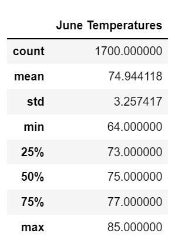
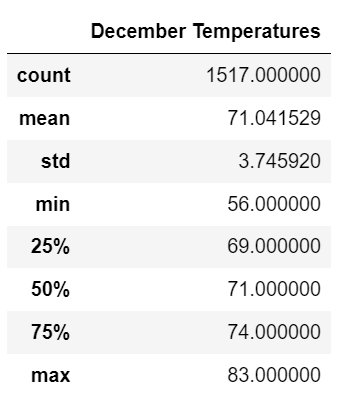

# Surfs Up: Year Round Sustainability of a Surf and Ice Cream Shop in Oahu

## Overview
In this analysis, using a SQLite Weather Database and Python, I extract temperature observations for the month of June and December in the years 2010-2017 to determine if the weather in Oahu is conducive to running a Surf and Ice Cream shop.

## Results
June and December temperatures were extract using a filter, and loaded into a datafram for analysis. You can see the descriptive statistics for each month below:

  

