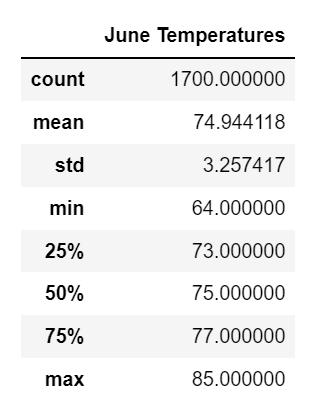
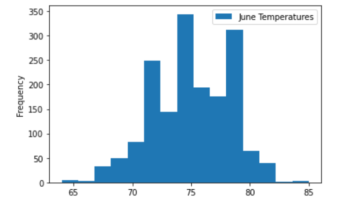
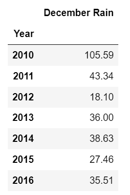

# Surfs Up: Year Round Sustainability of a Surf and Ice Cream Shop in Oahu

## Overview
In this analysis, using a SQLite Weather Database and Python, I extract temperature observations for the month of June and December in the years 2010-2017 to determine if the weather in Oahu is conducive to running a Surf and Ice Cream shop.

## Results
June and December temperatures were extract using a filter, and loaded into a dataframe for analysis. You can see the descriptive statistics and histograms for each month below:

 

 

### Key Differences
  * June has a mean temperature of about 71° F, four degrees less than December mean temperature of 75° F.
  * June has a minimum temperature of about 56° F, significantly higher than the December mean temperature of 64° F.
  * June has less spread, or variability in temperature, with a standard deviation of 3.26° F compared to the December standard deviation of 3.75° F

### Key Similarities
  * Overall, the air temperatures in Oahu in December and June are mild and temperate, with little difference between summer and winter. 
  * Although December has slightly more variability, there is still predictably temperate weather the majority of the time.

## Summary

### Additional Queries and Analysis

Based on temperature data alone, it appears that the weather in Oahu is conducive to running a Surf and Ice Cream Shop in Oahu. The temperatures for both months are mild and temperate. However, I performed a few additional queries to determine if there is a difference in rainfall between these months.

```
# Write a query that filters the Measurement table to retrieve the precipitation for the month of December and June.
prcp_dec = session.query(Measurement.prcp).filter(extract('month', Measurement.date)=='12').all()
prcp_june = session.query(Measurement.prcp).filter(extract('month', Measurement.date)=='06').all()
```

The code above extracted the daily rainfall over the last month for 2010-2017. The resulting analysis showed a mean daily rainfall of 0.21 inches in December, versus 0.13 inches in June. December also had a higher standard deviation, or variability, than June. You can see summary statistics below:

 

I used the code below to run additional queries to extract the dates for the rainfall measurements, split the data to get the year, merged dataframes, and grouped by year to get the sum of rainfall for December and June, by year. You can see at a glance that December is significantly rainier than June. Mean monthly rainfall for June is 27 inches, versus 44 inches for December.

```
# Yearly rain in december
prcp_dec_1 = session.query(Measurement.prcp, Measurement.date).filter(extract('month', Measurement.date)=='12').all()
prcp_dec_1_df = pd.DataFrame(prcp_dec_1, columns=['December Rain', 'Date'])
df = prcp_dec_1_df['Date'].str.split('-', expand=True)
df1 = df.iloc[:,0]

merged = prcp_dec_1_df.join(df1)
merged.columns.values[2] = 'Year'
annual_rain_dec = merged.groupby('Year').sum()
annual_rain_dec.describe()

```

 

### Conclusion

Although temperatures for both months are mild and temperate, December is part of Hawaii's rainy season, and has significantly  more rainfall than June. Although a surf and ice cream shop could still be highly successful, it should take into account reduced business due to rain in December. 
